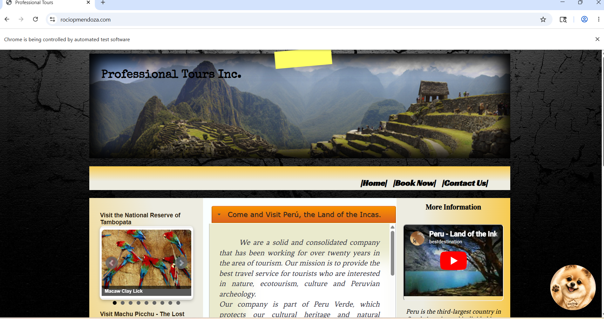
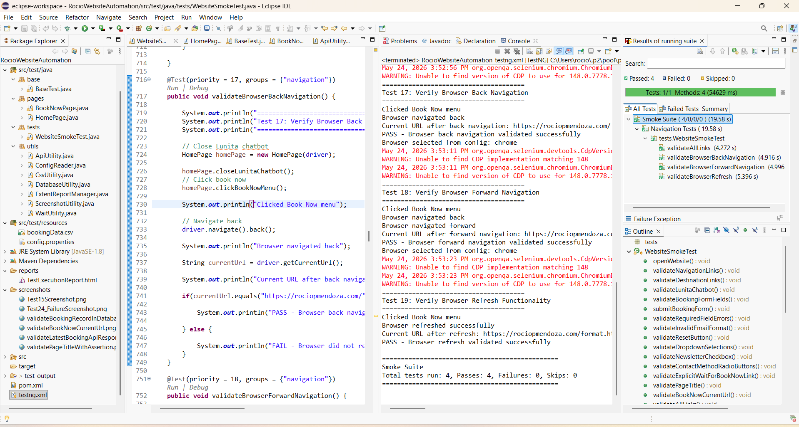
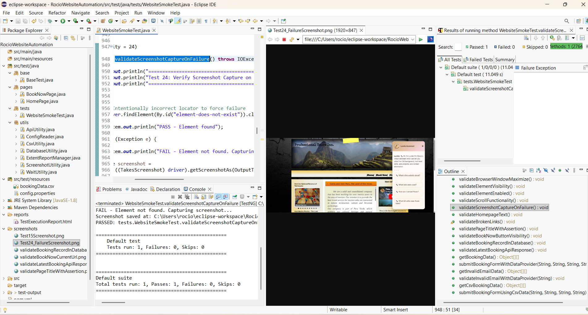
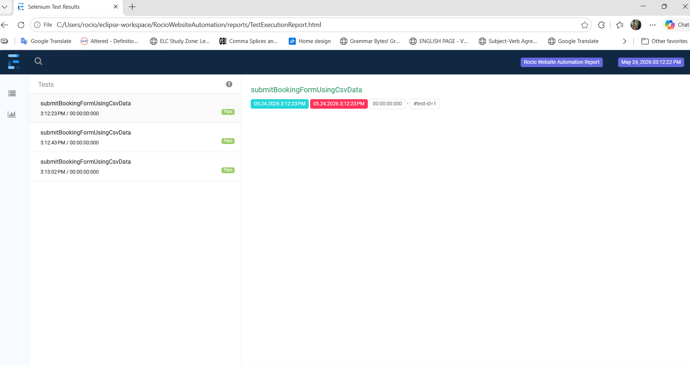

# RocioWebsiteAutomation

Selenium/TestNG automation framework with API, database, reporting, and data-driven testing.

---

# Project Overview

RocioWebsiteAutomation is a Selenium-based automation testing framework developed using Java, TestNG, Maven, and Page Object Model (POM) design principles.

This project was built to practice and demonstrate real-world QA automation concepts including:

- UI Automation Testing
- API Validation
- Database Validation
- Data-Driven Testing
- Extent Reporting
- Screenshot Capture
- Cross-Browser Testing
- Headless Execution
- Page Object Model (POM)
- CSV External Test Data

The automation framework validates the functionality of the Professional Tours demo website.

---

# Technologies Used

| Technology | Purpose |
|---|---|
| Java | Programming Language |
| Selenium WebDriver | UI Automation |
| TestNG | Test Execution Framework |
| Maven | Dependency Management |
| REST Assured | API Testing |
| MySQL | Database Validation |
| Extent Reports | HTML Reporting |
| Apache Commons IO | Screenshot File Handling |
| CSV | External Test Data |
| Eclipse IDE | Development Environment |

---

# Framework Architecture

```text
WebsiteSmokeTest.java
        ↓
extends BaseTest.java
        ↓
Page Objects
    • HomePage.java
    • BookNowPage.java
        ↓
Utilities
    • ConfigReader.java
    • CsvUtility.java
    • ApiUtility.java
    • DatabaseUtility.java
    • ScreenshotUtility.java
    • WaitUtility.java
        ↓
Resources
    • config.properties
    • bookingData.csv
        ↓
Outputs
    • Extent Reports
    • Screenshots
```

---

# Project Structure

```text
RocioWebsiteAutomation
│
├── base
│   └── BaseTest.java
│
├── pages
│   ├── HomePage.java
│   └── BookNowPage.java
│
├── tests
│   └── WebsiteSmokeTest.java
│
├── utils
│   ├── ApiUtility.java
│   ├── ConfigReader.java
│   ├── CsvUtility.java
│   ├── DatabaseUtility.java
│   ├── ExtentReportManager.java
│   ├── ScreenshotUtility.java
│   └── WaitUtility.java
│
├── src/test/resources
│   ├── config.properties
│   └── bookingData.csv
│
├── reports
│   └── TestExecutionReport.html
│
└── screenshots
```

---

# Features Implemented

## UI Automation

- Homepage validation
- Navigation testing
- Form submission testing
- Dropdown validation
- Radio button validation
- Browser navigation testing
- Link validation

## API Testing

- GET API validation
- JSON response validation
- API status verification

## Database Validation

- MySQL booking record verification
- SQL query execution
- Backend data validation

## Reporting

- Extent HTML reports
- Screenshot capture on failure
- Execution logging

## Data-Driven Testing

- TestNG DataProvider
- CSV externalized test data

## Browser Execution

- Chrome execution
- Firefox execution
- Headless mode execution

---

# Sample Tests

| Test ID | Description |
|---|---|
| Test 15 | Validate Book Now Current URL |
| Test 24 | Validate Page Title With Assertion |
| Test 29 | Validate Booking Record In Database |
| Test 30 | Validate Latest Booking API Response |
| Test 31 | Booking Form Submission Using DataProvider |
| Test 32 | Invalid Email Validation Using DataProvider |
| Test 33 | Booking Form Submission Using CSV Data |

---

# How To Run The Project

## Clone Repository

```bash
git clone <your-github-repository-url>
```

---

## Open Project

Import the project into Eclipse as a Maven project.

---

## Install Dependencies

Maven will automatically download dependencies from `pom.xml`.

---

## Run Tests

Right-click:

```text
WebsiteSmokeTest.java
```

Select:

```text
Run As → TestNG Test
```

---

# Reports

After execution:

```text
reports/TestExecutionReport.html
```

Contains:

- Pass/Fail status
- Execution logs
- Screenshots

---

# Screenshots

Failure screenshots are automatically saved under:

```text
screenshots/
```

---

# Learning Objectives

This project was created to strengthen hands-on experience with:

- Selenium Automation Framework Design
- Java Programming
- TestNG
- API Testing
- SQL Validation
- Page Object Model
- Reporting Utilities
- Data-Driven Testing
- QA Automation Best Practices

---
## Framework Structure



---

## TestNG Execution Results



---

## Screenshot Capture on Failure



---

## Extent Report



---

## Live Selenium Browser Automation


# Author

Rocio Pamela Mendoza

QA Automation | Manual Testing | API Testing | Healthcare QA

---

# Portfolio

https://rociopmendoza.com/
